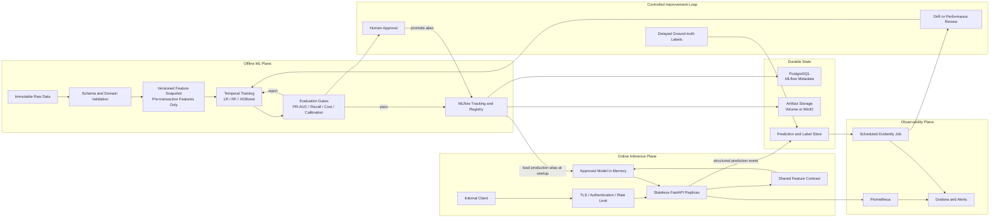

# Transaction Risk Scoring — Architecture and Technology Stack

## 1. Document Status

Dokumen ini adalah source of truth arsitektur untuk implementasi setelah technical review
Sprint 0–3. Detail pekerjaan dieksekusi melalui backlog di `docs/tickets/` dan urutan sprint
di `docs/sprint_docs.md`.

Status arsitektur saat ini:

- Sprint 0–1 menyediakan fondasi engineering dan batch data pipeline yang cukup baik untuk
  project lokal/portfolio.
- Sprint 2 sudah menghasilkan model dan evaluation flow, tetapi hasilnya harus direvalidasi
  setelah prediction-time feature contract diperbaiki.
- Sprint 3 memiliki experiment tracking dan registry flow, tetapi quality gate belum selesai.
- Sprint 4 tidak boleh dimulai sebelum Sprint 3.5 selesai.

Keputusan utama review:

> Sistem ditujukan sebagai local-first, production-oriented MLOps portfolio. Sistem tidak boleh
> mengklaim cloud-scale atau high availability hanya karena berjalan di local Kubernetes.

## 2. Context, Goal, and Non-Goals

### Goal

Mendemonstrasikan lifecycle machine learning yang dapat ditelusuri dan diuji untuk transaction
risk scoring:

```text
Raw data
  -> validated and versioned features
  -> temporal training and evaluation
  -> experiment tracking and model registry
  -> controlled model promotion
  -> online inference
  -> system and ML monitoring
  -> controlled retraining
```

### Primary prediction contract

Model memberikan risk score **sebelum transaksi diselesaikan**. Oleh karena itu, setiap model
feature wajib tersedia pada prediction time. Fitur yang baru muncul setelah transaksi diproses
tidak boleh menjadi input model online.

Jika kelak dibutuhkan post-transaction fraud detection, model tersebut harus menjadi use case,
dataset, registry name, endpoint, dan SLO yang terpisah.

### Intended users

- Developer atau reviewer yang menjalankan demo secara lokal.
- ML engineer yang menjalankan batch training dan model promotion.
- Client internal yang memanggil synchronous risk-scoring API.
- Operator yang memeriksa health, metrics, alerts, dan model version.

### Non-goals

- Multi-region cloud deployment.
- Exactly-once streaming platform.
- Kafka, Airflow, Kubeflow, atau feature-store platform sebelum kebutuhan nyata muncul.
- Automatic promotion langsung ke production hanya berdasarkan drift atau satu metric.
- Penyimpanan data transaksi nyata yang mengandung PII tanpa governance tambahan.

## 3. Architecture Principles

1. **Prediction-time correctness before model accuracy.** Offline feature tidak boleh memakai
   informasi yang tidak tersedia pada online request.
2. **One feature contract.** Training dan serving memakai daftar, tipe, urutan, dan transformasi
   feature yang sama.
3. **Temporal evaluation.** Model selection memakai validation period; test period hanya dipakai
   untuk final evaluation.
4. **Immutable and traceable artifacts.** Dataset snapshot, config, code revision, metrics, model,
   schema, dan threshold harus dapat ditelusuri.
5. **Stateless serving.** API menyimpan model approved di memory, tidak melakukan training atau
   memanggil registry pada setiap request.
6. **Controlled promotion.** Candidate hanya menjadi production setelah quality gate dan explicit
   approval.
7. **Local-first with production profiles.** Komponen sederhana menjadi default; komponen HA atau
   distributed hanya diaktifkan pada profile yang membutuhkannya.
8. **Security and observability by design.** Authentication, redaction, metrics, readiness, dan
   auditability bukan pekerjaan tambahan setelah deployment.

## 4. Deployment Profiles

| Concern | Local/MVP profile | Production-like profile |
|---|---|---|
| Data processing | Local PySpark | Spark runtime yang resource-nya configurable |
| MLflow backend | SQLite | PostgreSQL |
| Model artifacts | Local filesystem volume | S3-compatible object storage/MinIO |
| Serving | One FastAPI process or Docker Compose | Multiple stateless replicas |
| Orchestration | Docker Compose | kind Kubernetes for demonstration |
| Monitoring | Structured logs + local metrics | Prometheus, Grafana, alert rules |
| Drift jobs | Manual/scheduled batch | Kubernetes CronJob or scheduled CI job |
| Availability claim | Developer convenience | Pod/process resilience only; kind single-node is not node HA |

Cloud services may replace PostgreSQL/object storage/Kubernetes later, but they are intentionally
provider-neutral in this project.

## 5. Target Architecture



## 6. Data and Feature Architecture

### Layering

```text
data/raw/                       immutable local source, ignored by Git
data/processed/canonical/       canonical transaction snapshot
data/processed/features/audit/  full feature schema for profiling/audit only
data/processed/features/        model-ready split root
  train/                        contract projection + target/integrity key
  validation/                   contract projection + target/integrity key
  test/                         contract projection + target/integrity key
artifacts/manifests/            dataset/schema/config fingerprints
```

Every generated snapshot must have a manifest containing at least:

- Dataset name and source.
- Row count and positive/negative target counts.
- Minimum and maximum event timestamp.
- Schema fingerprint.
- Source/input fingerprint.
- Feature-contract version.
- Pipeline code commit.
- Config hash and creation timestamp.

### Allowed pre-transaction feature groups

- Transaction type and amount.
- Timestamp-derived values such as hour and day-of-week.
- Origin and destination balances available before authorization.
- Ratios derived only from pre-transaction values.
- Historical velocity/aggregation features computed strictly before current event time.

### Forbidden online model features

- `origin_balance_after`.
- `destination_balance_after`.
- `origin_balance_delta` and `destination_balance_delta` when based on after-balance.
- `origin_balance_mismatch` and `destination_balance_mismatch` when after-balance is required.
- `origin_balance_depleted`.
- `destination_balance_increased`.
- Target, proxy label, identifiers, atau future transaction values.

Post-transaction fields may remain in canonical data for profiling, audit, atau a separate post-event
model. They must not enter the pre-transaction model feature list.

### Historical features and online parity

For the first serving MVP, only request-available features are required. Historical behavioral
features may be enabled only when their online source and freshness contract exist. Until then,
they must not silently be filled with arbitrary defaults.

An advanced profile may use Redis or another state store for recent account aggregates. Adding a
feature-store product is not required for this project.

## 7. Batch Pipeline Performance Rules

- Avoid repeated `count()` or independent scans when one aggregation can produce the same result.
- Persist only DataFrames reused by multiple actions, and always unpersist them.
- Avoid unpartitioned global windows for split and sampling on large data. Exact row caps remain
  available only where exact counts are part of the reproducibility contract; the default large-data
  split uses distributed timestamp boundaries.
- Make Spark master, driver memory, shuffle partitions, and output partitions configurable.
- Prefer deterministic hash sampling that does not force a global `row_number` operation.
- Do not cap final test evaluation by default. If sampling is required, use a separately named,
  stratified evaluation sample and report confidence/coverage.
- Write canonical, feature, and split datasets into unambiguous directories; do not mix root
  Parquet files and child datasets as one logical table.

PySpark remains in the stack because the project demonstrates distributed data engineering on the
6.36M-row PaySim dataset. It is not evidence of horizontal scalability until the pipeline is tested
on a multi-worker runtime.

## 8. Model Development and Evaluation

### Models

- Logistic Regression as explainable baseline.
- Random Forest as non-linear comparison.
- XGBoost as a candidate, not an assumed winner.

### Training rules

- Preprocessing is fit only on training data.
- Class weighting and sampling effects must be evaluated together; do not apply both blindly.
- Validation and test distributions must remain representative of their chronological periods.
- Hyperparameters and random seeds live in typed configuration.
- XGBoost training should use an evaluation set and early stopping when beneficial.
- Probability calibration is required before interpreting the output as a risk probability.

### Evaluation gates

Minimum metrics:

- PR-AUC and ROC-AUC.
- Precision, recall, and F1 at the selected threshold.
- Confusion matrix.
- Brier score and calibration curve.
- Prediction volume and alert rate.
- Expected business cost using configured false-positive and false-negative assumptions.
- Results for each temporal validation/backtest window when available.

The threshold selection configuration must include business cost assumptions and an optional
minimum recall constraint. `false_positive_cost=1` and `false_negative_cost=1` are acceptable only
as an explicitly documented neutral test scenario.

## 9. MLflow Tracking and Registry

### Current/local profile

```yaml
tracking:
  uri: sqlite:///mlflow.db
  experiment_name: transaction-risk-classification
  registered_model_name: transaction-risk-model
  artifact_location: mlartifacts
```

SQLite and local artifacts are acceptable for one local writer. They are not the production-like
HA design.

### Compatibility contract

- The codebase intentionally uses the MLflow 3.x `name` argument when logging a model.
- Internal domain objects may continue to call that value `artifact_path`; external API naming and
  internal field naming must not be conflated.
- `pyproject.toml`, tests, and implementation must declare and verify the same supported MLflow
  version range.

### Required run/model metadata

- Git commit and dirty/clean state.
- Dataset and feature snapshot fingerprints.
- Config hash.
- Feature-contract and schema version.
- Model parameters and imbalance strategy.
- Validation, threshold, calibration, and final test metrics.
- Model signature and safe input example.
- Reviewer, rationale, and time for staging/production promotion.

Model loading is allowed only from the trusted registry/artifact location. Because pickle-based
formats can execute code during deserialization, artifact access and integrity must be controlled.

## 10. Online Model Serving

### Endpoints

```text
POST /v1/predictions
GET  /health/live
GET  /health/ready
GET  /model/info
GET  /metrics
```

### Serving behavior

- Load the model referenced by the configured registry alias during application startup.
- Keep the validated model and threshold in memory.
- Fail readiness if model, schema, threshold, or required dependency cannot be loaded.
- Do not query MLflow on every prediction.
- Reject unknown fields, missing features, invalid ranges, and oversized requests.
- Return risk score, decision, model name/version, feature-contract version, and request ID.
- Support graceful shutdown and bounded request timeouts.
- Emit a prediction event without blocking the synchronous response path.

`/health/live` only indicates that the process is responsive. `/health/ready` indicates that the
service can perform a valid prediction. Configuration or secrets must not be exposed through a
public `/config` endpoint.

For local/internal use, API-key authentication is configured with `API_AUTH_ENABLED=true` and an
`API_KEY` injected by the process environment or secret mount. Health probes remain unauthenticated;
the reverse proxy/ingress is responsible for TLS termination, network policy, and any enterprise
identity integration. Never pass the API key through source control, Docker image layers, or logs.

## 11. Security and Compliance Baseline

- TLS terminates at the ingress/reverse proxy for non-local traffic.
- Internal clients authenticate with a documented mechanism; authorization is least-privilege.
- Apply rate limits and request-size limits.
- Secrets come from environment/secret mounts, never Git or ConfigMap.
- Images run as non-root with read-only root filesystem where possible.
- Pin and scan dependencies and base images; generate an SBOM.
- Redact or hash account identifiers in logs and metrics.
- Define prediction/label retention and deletion policies.
- MLflow UI, registry, database, and artifact storage are not public endpoints.
- Promotion and model changes produce an audit trail.

## 12. Reliability and Scalability

### Inference

- Stateless replicas support horizontal scaling.
- Resource requests/limits are based on load-test evidence.
- Startup/readiness/liveness probes have distinct semantics.
- Rolling deployment must preserve at least one ready replica.
- Rollback uses the previous image and model alias/version.
- HPA is enabled only after a useful CPU/RPS/latency signal is measured.

### State

- Local profile uses recoverable volumes and documented reset procedures.
- Production-like profile backs up PostgreSQL and artifact storage.
- Registry aliases are pointers to immutable model versions.
- Prediction events are append-only and tolerate temporary monitoring-job failures.

### Availability boundary

Multiple pods on a single-node kind cluster protect only from process/pod failure. They do not
protect from host, node, disk, or local network failure. This limitation must remain visible in the
README and demo.

## 13. Observability

### System metrics

- Request count and rate.
- Error and rejection rate.
- p50/p95/p99 latency.
- In-flight requests.
- Model load/reload failures.
- Prediction count by non-sensitive decision class.
- CPU, memory, restart count, and readiness state.

### ML monitoring

- Missing, invalid, and out-of-range feature rates.
- Feature distribution and drift.
- Prediction distribution and drift.
- Delayed precision, recall, PR-AUC, and calibration after labels arrive.
- Model version and feature-contract version segmentation.

Evidently jobs run asynchronously on a schedule. Prometheus metrics must avoid transaction IDs,
account IDs, or any unbounded-cardinality labels.

## 14. Retraining and Promotion

```text
Drift/performance signal
  -> review and versioned dataset snapshot
  -> retraining
  -> temporal evaluation and leakage gates
  -> candidate alias
  -> optional shadow/canary evaluation
  -> explicit approval
  -> production alias
  -> controlled rollout
  -> rollback on SLO or quality regression
```

Drift alone is not proof that a new model is better. Retraining may be automated; production
promotion remains controlled unless a future governance decision explicitly changes that policy.

## 15. Technology Decisions

| Layer | Technology | Decision |
|---|---|---|
| Language | Python 3.12 | Keep |
| Batch data | PySpark | Keep for learning/data-pipeline scope; tune and profile |
| Tabular ML | scikit-learn, XGBoost | Keep |
| Data contracts | Explicit Spark schemas and validation | Keep; Pandera is optional, not required if unused |
| Tracking/registry | MLflow 3.x-compatible API | Keep and pin supported range |
| API | FastAPI + Pydantic | Keep |
| Local orchestration | Docker Compose | Make primary runtime |
| Kubernetes demo | kind | Keep as optional production-like profile |
| Metrics/dashboard | Prometheus + Grafana | Add in observability sprint |
| ML monitoring | Evidently batch jobs | Add after prediction logging exists |
| Metadata database | SQLite local, PostgreSQL production-like | Profile-dependent |
| Artifact storage | Filesystem local, MinIO production-like | Profile-dependent |
| CI | GitHub Actions | Expand quality gates |
| Scheduling | GitHub Actions schedule or Kubernetes CronJob | Prefer over Airflow for current scope |

### Intentionally deferred

- Kafka.
- Airflow.
- Kubeflow.
- Cloud-specific managed services.
- Terraform until a real remote environment exists.
- Distributed tracing until there is more than one meaningful online service hop.

## 16. Dependency and Packaging Strategy

Use separately installable dependency groups, for example:

```text
core        shared schemas/contracts
training    PySpark, pandas, sklearn, XGBoost
tracking    MLflow and database driver
serving     FastAPI, Uvicorn, model runtime
monitoring  Evidently and reporting dependencies
dev         pytest, Ruff, pre-commit, load-test tooling
```

Package discovery must include `app`, `ml`, and executable pipeline modules, or adopt a `src/`
layout. CI must build a wheel, install it into a clean environment, and run an import/smoke test so
editable installs do not hide packaging defects.

Use a committed lock/constraints strategy for repeatable CI and runtime builds.

## 17. Target Repository Structure

```text
transaction-risk-ml/
├── app/
│   ├── api/routes/
│   ├── core/
│   ├── inference/
│   └── main.py
├── ml/
│   ├── contracts/
│   ├── data/
│   ├── features/
│   ├── training/
│   ├── evaluation/
│   ├── tracking/
│   └── monitoring/
├── pipelines/
├── configs/
├── deployment/
│   ├── docker/
│   ├── compose/
│   └── kubernetes/
├── monitoring/
│   ├── prometheus/
│   ├── grafana/
│   └── evidently/
├── tests/
│   ├── unit/
│   ├── integration/
│   ├── contract/
│   ├── model/
│   └── load/
├── docs/
│   └── tickets/
├── pyproject.toml
└── README.md
```

Notebook tetap hanya untuk exploration dan visualization. Production logic harus berada di module
yang dapat diuji.

## 18. Quality Gates

Setiap perubahan harus lulus gate yang relevan:

```text
ruff check
ruff format --check
unit tests
integration tests
wheel build and clean-install smoke test
data/feature contract tests
model leakage tests
MLflow registry integration test
container smoke and vulnerability scan
API contract and load tests
```

Test yang tidak dapat berjalan karena environment harus dilaporkan sebagai **not executed**, bukan
passed. CI status hanya boleh disebut green jika run remote pada commit yang sama sudah berhasil.

## 19. Implementation Order

1. Sprint 3.5: feature correctness, MLflow repair, packaging, reproducibility, dan evaluation.
2. Sprint 4: inference API and serving contract.
3. Sprint 5: containerization, Compose, load testing, lalu optional kind deployment.
4. Sprint 6: system observability, prediction logging, label feedback, dan drift monitoring.
5. Sprint 7: controlled retraining, promotion, rollout, dan rollback.
6. Final release validation: one-command demo and documented failure/recovery scenarios.

Detailed execution tickets and AI-agent prompts are maintained in `docs/tickets/README.md`.
